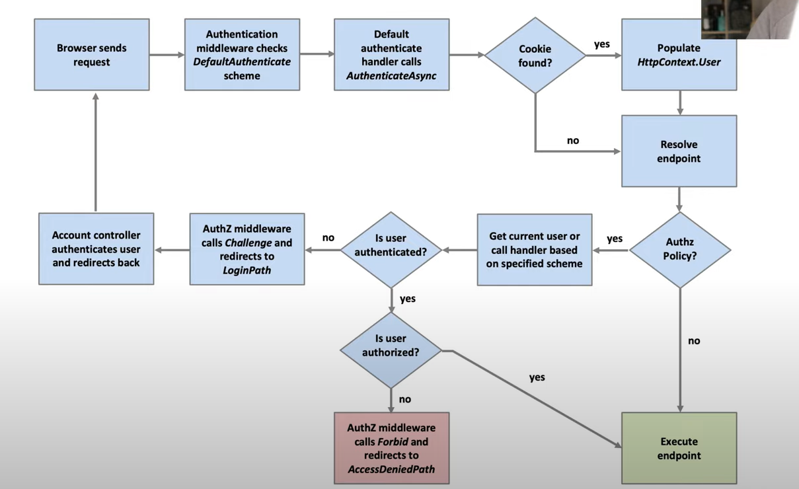
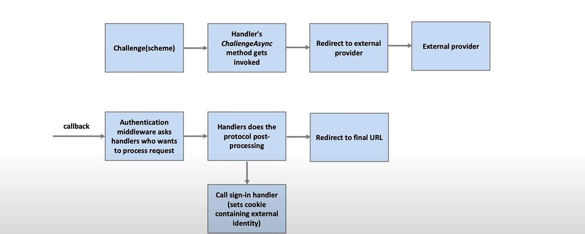
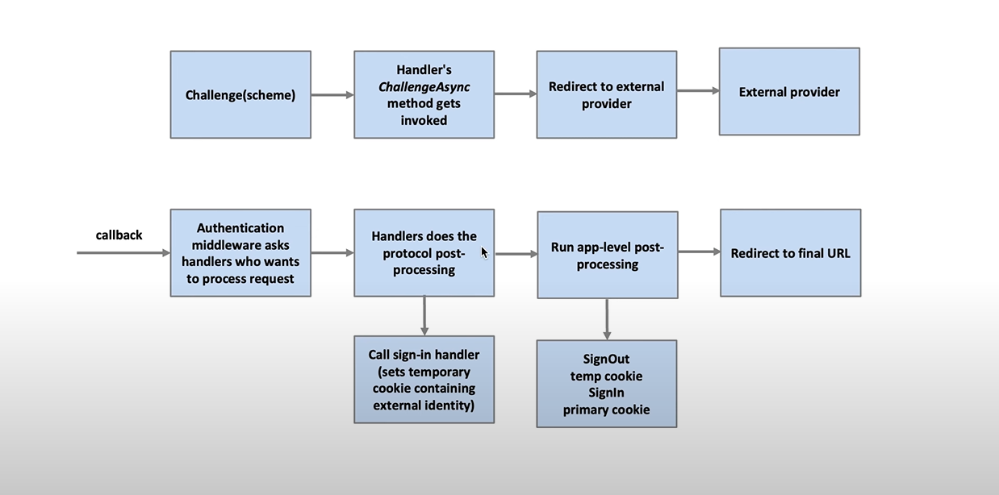

# Authentication and Authorization

## Building Blocks of Authentication

- Authentication handler: an implementation of a specific authentication method
	- Cookies for browser-based authentication -> CookieAuthenticationHandler
	- JWT for token-based API authentication -> JwtBearerHandler
	- Google, Facebook, and other external providers -> RemoteAuthenticationHandler
	- OpenID Connect/WS-Federation for stardards-based external authentication -> OpenIdConnectHandler


- There are many authentication schemes.
- **A scheme is a unique name for an authentication handler.**
- When add authentication, we can specify the default scheme we want to use.

- ClaimsPrincipal represents the user.
- ClaimsPrincipal contains many ClaimsIdentity objects, each obbject for each authentication scheme.
- ClaimsIdentity contains a collection of Claim objects. When we create it, we need to specify
an authentication type which is some metadata how that user has authenticated to our system.

- There are 3 scheme actions:
	- Authenticate
	- Challenge: determines what happens if a anonymous user tries to access a resource.
	- Forbid: determines what happens if the user tries to access a resource that they are not authorized to access.

### IAuthenticationService

- It defines important methods for:
	- Authenticate
	- Sign In
	- Sign Out
	- Challenge
	- Forbid
- On top of this, there are extension methods on top of HttpContext:
	- Each method has 2 overload, one with a scheme and one with a default scheme.


**When login, use LocalRedirect() method to avoid phishing attack.**

- AuthenticationProperites: a dictionary of key-value pairs that can be used to 
pass additional information about authentication session to the authentication handler.




## Cookies Authentication

```c#
builder.Services.AddAuthentication(CookieAuthenticationDefaults.AuthenticationScheme)
.AddCookie("CookieAuth", options =>
{
    options.Cookie.Name = "CookieAuth";
    options.LoginPath = "/Account/Login";
    options.AccessDeniedPath = "/Account/AccessDenied";
    options.ExpireTimeSpan = TimeSpan.FromSeconds(5);

	options.Cookie.SameSite = SameSiteMode.Strict;

    options.Events = new CookieAuthenticationEvents
    {
        OnValidatePrincipal = context =>
		{
			var lastChanged = context.Principal.Claims.FirstOrDefault(c => c.Type == "LastChanged");
			if (lastChanged == null || !DateTime.TryParse(lastChanged.Value, out var lastChangedDate))
			{
				context.RejectPrincipal();
				return Task.CompletedTask;
			}

			if (lastChangedDate.AddMinutes(5) < DateTime.UtcNow)
			{
				context.RejectPrincipal();
			}

			return Task.CompletedTask;
		}
    };
});

// translate Cookies into Security Context (ClaimsPrinciple) 
app.UseAuthentication(); 
```

## Google Authentication in MVC 



### External Authentication with Callback



Install package Microsoft.AspNetCore.Authentication.Google

```c#
builder.Services.AddAuthentication(options =>
{
	options.DefaultScheme = CookieAuthenticationDefaults.AuthenticationScheme;
	//options.DefaultChallengeScheme = GoogleDefaults.AuthenticationScheme;
})
.AddCookie()
// another cookie for storing the outcome of external authentication
// so that it can be available to our callback endpoint
// it is a short-lived cookie
.AddCookie(ExternalAuthenticationDefaults.AuthenticationScheme)
.AddGoogle(options =>
{
	options.ClientId = "your-client-id";
	options.ClientSecret = "your-client";

	// the handler to sign in
	options.SignInScheme = ExternalAuthenticationDefaults.AuthenticationScheme;

	//options.CallbackPath = "/signin-google";
	
	// transform claims
	// only useful when we don't want to show UI to user
	options.Events = new OAuthEvents()
	{
		// authentication ticket is passed through session manager
		OnCreatingTicket = e =>
		{
			e.Principal
		}
	};	
});
```

```c#
public static class ExternalAuthenticationDefaults
{
    public const string AuthenticationScheme = "ExternalIdentity";
}
```

```c#
public IActionResult LoginWithExternal(string scheme, string? returnUrl)
{
	if (!Url.IsLocalUrl(returnURl))
	{
		return BadRequest();
	}

	var properties = new AuthenticationProperties
	{
		RedirectUri = Url.Action(nameof(ExternalLoginCallback)),
		Items =
		{
			{ "scheme", scheme },
			{ "returnUrl", returnUrl }
		}
	};
	
	return Challenge(properties, scheme);
}
```

Authentication Callback Pattern

```c#	
public async Task<IActionResult> ExternalLoginCallback()
{
	// AuthenticateAsync is different from SignInAsync 
	// AuthenticateAsync does not persist the ClaimsPrincipal in the cookie

	// read the outcome of the external authentication

	// this method behaviour is like Authentication middleware
	var result = await HttpContext.AuthenticateAsync(
		ExternalAuthenticationDefaults.AuthenticationScheme);

	if (!result.Succeeded)
	{
		throw new Exception("External authentication failed.");
	}

	if (result.Principal is null)
	{
		throw new Exception("Google authentication failed.");
	}

	var externalUser = result.Principal;

	var subjectClaim = externalUser.FindFirst(ClaimTypes.NameIdentifier);

	if (subjectIdClaim is null)
	{
		throw new Exception("Google authentication failed.");
	}
	
	// we need the scheme to know which external provider the user used
	// because the subject is only unique within the provider

	var issuer = result.Properties.Items["scheme"];
	var subjectValue = subjectClaim.Value;

	// get user from database

	var user = await _userService.GetBySubject(subjectValue, issuer);
	if (user is null)
	{
		throw new Exception("User not found.");
	}

	
	// sign in the user into our app

	var claims = new List<Claim>
	{
		new Claim(ClaimTypes.NameIdentifier, user.Id.ToString()),
		new Claim(ClaimTypes.Name, user.UserName),
		new Claim(ClaimTypes.Email, user.Email),
		new Claim("LastChanged", DateTime.UtcNow.ToString())
	};

	var identity = new ClaimsIdentity(claims, CookieAuthenticationDefaults.AuthenticationScheme);
	var principal = new ClaimsPrincipal(identity);
	await HttpContext.SignInAsync(CookieAuthenticationDefaults.AuthenticationScheme, principal);

	await HttpContext.SignOutAsync(ExternalAuthenticationDefaults.AuthenticationScheme); 

	return Redirect(result.Properties.Items["returnUrl"]);
}
```

## ASP.NET Core Identity

- Security Stamp: a value that changes when the user's credentials change.
	- When new request is made, the security stamp in cookie is compared to database value.


```c#
builder.Services.AddTransient<UserManager<IdentityUser>>();
builder.Services.AddTransient<RoleManager<IdentityRole>>();

builder.Services.AddIdentity<IdentityUser, IdentityRole>(options =>
{
    options.User.RequireUniqueEmail = true;

    options.Lockout.MaxFailedAccessAttempts = 5;
    options.Lockout.DefaultLockoutTimeSpan = TimeSpan.FromMinutes(30);
    options.SignIn.RequireConfirmedEmail = true;

    options.Password.RequireDigit = false;
    options.Password.RequireNonAlphanumeric = false;
    options.Password.RequireUppercase = false;
    options.Password.RequireLowercase = false;
    options.Password.RequiredLength = 6;
    options.Password.RequireDigit = false;

    options.Lockout.MaxFailedAccessAttempts = 5;
})
           .AddEntityFrameworkStores<DataContext>()
           .AddDefaultTokenProviders();

// Configure token lifespan
builder.Services.Configure<DataProtectionTokenProviderOptions>(options =>
{
    options.TokenLifespan = TimeSpan.FromMinutes(30);
});
```

### Claims Transformation

```c#
public class ClaimsTransformer : IClaimsTransformation
{
	private readonly IUserService _userService;

	public ClaimsTransformer(IUserService userService)
	{
		_userService = userService;
	}

	public async Task<ClaimsPrincipal> TransformAsync(ClaimsPrincipal principal)
	{
		var clonedPrincipal = principal.Clone();

		if (clonedPrincipal.Identity is null)
		{
			return clonedPrincipal;
		}

		var identity = (ClaimsIdentity)clonedPrincipal.Identity;

		var existingClaim = identity.Claims.FirstOrDefault(c => c.Type == "");	

		if (existingClaim is not null)
		{
			return clonedPrincipal;
		}

		identity.AddClaim(new Claim("", ""));

		var nameClaim = identity.Claims.FirstOrDefault(c => c.Type == ClaimTypes.NameIdentifier);
		
		if (nameClaim is null)
		{
			return clonedPrincipal;
		}

		return clonedPrincipal;
	}
}
```

### MFA with QR Code

```c#
private async Task LoadSharedKeyAndQrCodeUriAsync(IdentityUser user)
{
	var unformattedKey = await _userManager.GetAuthenticatorKeyAsync(user);

	if (string.IsNullOrEmpty(unformattedKey))
	{
		await _userManager.ResetAuthenticatorKeyAsync(user);
		unformattedKey = await _userManager.GetAuthenticatorKeyAsync(user);
	}

	SharedKey = FormatKey(unformattedKey);

	var email = await _userManager.GetEmailAsync(user);

	QrCodeUri = GenerateQrCodeUri(email, unformattedKey);
}

private string FormatKey(string unformattedKey)
{
	var result = new StringBuilder();
	int currentPosition = 0;

	while (currentPosition + 4 < unformattedKey.Length)
	{
		result.Append(unformattedKey.Substring(currentPosition, 4)).Append(" ");
		currentPosition += 4;
	}

	if (currentPosition < unformattedKey.Length)
	{
		result.Append(unformattedKey.Substring(currentPosition));
	}

	return result.ToString();
}

private string GenerateQrCodeUri(string email, string unformattedKey)
{
	return string.Format(
		CultureInfo.InvariantCulture,
		AuthenticatorUriFormat,
		_urlEncoder.Encode("MyApp"),
		_urlEncoder.Encode(email),
		unformattedKey
	);
}
```

